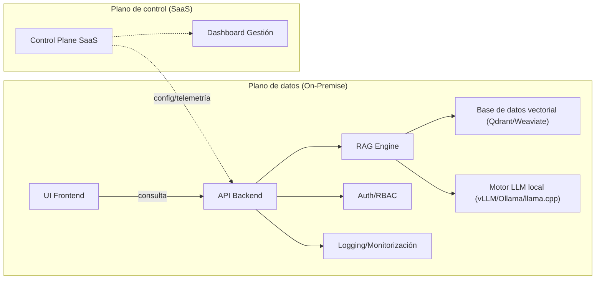

# Resumen Ejecutivo  
Proponemos un **runtime local empaquetado** (instalación única Docker/Helm) para ejecutar la IA generativa sobre los datos sensibles de la empresa completamente *on-premise*, con un plano de control SaaS opcional **sin datos**. De este modo, todo el código fuente, documentos y conversaciones permanecen dentro de la infraestructura del cliente【67†L61-L70】, cumpliendo normativas de privacidad (por ejemplo BAIT, GDPR art. 9, HIPAA, etc.) sin depender de proveedores cloud【67†L61-L70】【46†L87-L96】. La arquitectura consta de un **plano de datos privado** (API + motor RAG + base de vectores + motor LLM) y un **plano de control externo** solo para gestión (licencias, métricas, configuración), sin acceso a la información del cliente. El sistema se despliega con Docker o Kubernetes, orquestado localmente. Recomendamos LLMs open-source potentes (Gemma 4, Mistral 7B, LLaMA 2/3) y runtimes optimizados (vLLM para alto rendimiento multiusuario, Ollama/llama.cpp para escenarios ligeros)【22†L185-L193】【28†L277-L284】. En términos de negocio, el modelo sería “open core”: ofrecemos el código y binarios on-prem, soporte y actualizaciones bajo licencia, con un control plane SaaS de valor añadido (paneles, orquestación), suscripción por usuario o por capacidad. Los principales riesgos (exfiltración de datos, inyección de prompts, dependencias externas, vulnerabilidades de contenedores) se mitigan con aislamiento total, filtrado de prompts, RBAC estricto, cifrado, actualizaciones firmadas, escaneo de contenedores, logging de seguridad y procedimientos de hardening. Este informe detalla la **arquitectura técnica** (con diagramas), el **stack recomendado** (modelos, runtimes, bases de vectores), **opciones de provisión** de los modelos, aspectos de **seguridad y compliance**, consideraciones de despliegue/operaciones, **modelo de negocio**, riesgos residuales, estrategia de mercado para sectores regulados, checklist de entrega e incluso ejemplos de contratos/licencias clave.  

## 1. Arquitectura Técnica Detallada  
La solución se compone de dos planos:  

- **Plano de datos (on-premise):** Aquí se ubica todo el procesamiento de IA. Incluye:  
  - **Frontend UI** (p. ej. web o app interna) para consultas de los usuarios autenticados.  
  - **API Backend** (p. ej. FastAPI/Django) que recibe consultas, aplica lógica de negocio y construye el prompt.  
  - **Módulo RAG (retrieval-augmented generation):** se encarga de extraer contexto de las bases de conocimiento. Recibe el prompt, genera vectores (embeddings) con un modelo de incrustaciones y los busca en la base vectorial para recuperar documentos relevantes.   
  - **Base de datos vectorial local** (p. ej. Qdrant o Weaviate) que almacena embeddings de documentos, código, tickets, etc. Responde consultas de similitud (búsqueda ANN) para RAG【18†L165-L172】.  
  - **Motor LLM local** (runtime de inferencia): ejecuta un modelo de lenguaje (Gemma, Mistral, LLaMA, etc.) usando los documentos recuperados + la consulta, para generar la respuesta final【65†L136-L142】. Este motor corre en CPU/GPU local (sin llamar a servicios externos).  
  - **Servicios auxiliares:** base de usuarios (con LDAP/SSO), servidor de autorización con RBAC, registro de logs de auditoría, y almacenamiento seguro de datos (por ej. persistencia de vector DB y BLOB de documentos).  

- **Plano de control (SaaS opcional):** Es puramente de gestión y **no procesa datos del cliente**. Se aloja en nuestra infraestructura (puede ser multitenant) y ofrece:  
  - **Gestión de licencias y activaciones:** las instalaciones on-prem registran una licencia (incluso offline con archivo de llave).  
  - **Configuración y telemetría no sensible:** paneles de métricas anónimas (nº de peticiones, latencias) y despliegue de actualizaciones de software.  
  - **Orquestación centralizada:** catálogo de modelos/embeddings disponibles, flujos de CI/CD de containers, sendboxes.  

Internamente, la comunicación es aislada: todo permanece detrás del firewall de la empresa. El plano de control solo interactúa con el API backend mediante canales seguros (p.ej. HTTPS con certificados) para puentear configuraciones o reportar métricas; **no** recibe datos de negocio.  


*Figura 1. Arquitectura propuesta: todo el procesamiento de consulta ocurre on-premise (izquierda) con RAG y LLM locales. El plano de control (derecha) solo gestiona licencias y métricas sin acceder a datos de usuario.*  

Además, el despliegue se empaqueta con Docker Compose o Helm: p.ej. un contenedor para el **backend API**, otro para la **base vectorial** y otro para el **servicio de inferencia** LLM. Estas piezas pueden orquestarse en Kubernetes para escalado (p.ej. múltiples réplicas de inferencia) o ejecutarse en una sola máquina con Compose. La comunicación interna usa REST/gRPC y puertos internos, con TLS si es necesario. Por ejemplo:

```bash
# Ejemplo simplificado de despliegue con Docker Compose (fig. conceptual)
docker-compose up -d
# Ejemplo de despliegue en Kubernetes con Helm
helm install ai-suite ./helm-chart -f values.yaml
```

## 2. Stack Tecnológico Recomendado  

- **Modelos LLM:** Recomendamos modelos open-source de última generación:  
  - *Gemma 4 (Google)*: series E2B/E4B (2–4B parámetros, contextos hasta 128K) y grandes (26B A4B MoE, 31B dense)【2†L369-L378】. Gemma-4-E2B/E4B requiere solo ~5 GB de VRAM en quantización 4-bit (15 GB en FP16), mientras Gemma-4-31B necesita ~20–34 GB【3†L101-L105】【2†L369-L378】. Licencia: código abierto limitado al uso (descargable de Google). Excelente relación rendimiento/size con cuantización agresiva.  
  - *Mistral 7B (Mistral AI)*: 7.3B parámetros, licencia Apache-2.0 (sin restricciones de uso)【26†L29-L37】【26†L39-L46】. Supera en benchmarks a Llama 2 13B y Llama 1 34B【26†L29-L37】. Ideal para balance: performance alto con solo 7B (recomendado en GPUs >6 GB).  
  - *Llama 2/3 (Meta)*: versiones 7B/13B/70B (Llama 2) o Llama 3 8B/13B/70B. Licencia abierta (uso limitado, fines académicos/comerciales)【26†L29-L37】. 8B en 16-bit caben en ~20–30 GB. Son muy usados, buen soporte, y pueden servir de respaldo.  
  - **Otras opciones:** Gemma-2B/E4B en dispositivos con poco VRAM (<8 GB), modelos de código (CodeLlama, StarCoder) para búsquedas en repositorio, etc.

- **Runtimes de inferencia:** Servidores optimizados que cargan los pesos y sirven el modelo:  
  - *vLLM* (Meta): PyTorch + Triton, pensado para throughput alto y multi-usuario. Escala automáticamente con concurrencia, ofreciendo baja latencia inicial bajo carga【22†L185-L193】【28†L275-L284】. Apache-2.0. Excelente para GPUs (desde A100/H100 a elásticos).  
  - *Ollama Server* (Ollama): CLI en Go envuelve `llama.cpp` para gestión de modelos; fácil de instalar (`ollama pull llama3:8b`). Enfocado a desarrolladores, limitado a ~4 paralelismos por defecto. MIT license (según repo). Útil para despliegues medianos, admite GPU y CPU. Rendimiento moderado【28†L277-L286】.  
  - *llama.cpp*: Motor C++ puro (MIT). Funciona en CPU usando PyTorch/BLAS o GPUs. Permite ejecutar casi cualquier modelo (Llama, Gemma, Mistral) con formatos GGUF/ckpt y soporta cuantización 4/8-bit. Ideal para servidores sin GPU o para compatibilidad máxima (por ejemplo, CPUs con AVX-2). Razonable para cargas ligeras o pruebas.  
  - **Comparativa (Resumen):**

  | Runtime | Orientación | Hardware óptimo | Concurrencia | Licencia |
  |:---|:---|:---|:---|:---|
  | **vLLM** | Multiusuario/producción | GPUs NVIDIA (A100/H100) | Alto (dinámico)【22†L185-L193】 | Apache 2.0 |
  | **Ollama Server** | Fácil de usar/dev local | GPU único (A100 mínimo) o CPU | Bajo por defecto (tunear hasta ~32)【28†L297-L304】 | MIT |
  | **llama.cpp** | CPUs/portabilidad | CPU (también GPU) | Único/Batch (estático)【22†L185-L193】 | MIT |

- **Bases de datos vectoriales:**  
  - *Qdrant:* Open-source (licencia Apache 2.0) escrito en Rust. Es rápido y escalable para embeddings densos【18†L165-L172】. Se despliega localmente vía Docker sin costo adicional【43†L165-L172】. Soporta vectores cuantizados y metadatos JSON. Ideal para RAG de documentos voluminosos.  
  - *Weaviate:* Open-source (BSD-3-Clause)【20†L83-L92】, vector DB escalable con clusters y GraphQL API. Viene con clientes Python/JS y soporta despliegue local o en nube【20†L83-L92】. Buena elección si se prefiere ecosistema con herramientas adicionales (pods, DB multimodal).  
  - *pgvector:* Extensión de Postgres que agrega búsquedas vectoriales. Conveniente si ya existe infraestructura PostgreSQL; escala hasta medianos volúmenes.  
  - *Comparativa:* Qdrant y Weaviate son especializados (alto rendimiento ANN) y permiten escalado horizontal. pgvector es más general pero puede ser suficiente inicialmente.

  【63†embed_image】 *Figura 2. Estructura conceptual de una base de datos vectorial: cada entrada tiene un ID, un vector (dimensions) y una carga útil (metadatos)【18†L165-L172】.* Las bases vectoriales (como Qdrant) indexan estos vectores para búsquedas de similitud.  

- **Embeddings:** Modelo preentrenado de incrustaciones (por ejemplo, Sentence Transformers o el modelo TEI de Hugging Face) para convertir documentos/chat a vectores. Se aloja localmente o en servicios on-prem de Hugging Face (HuggingFace TEI self-hosted).  

- **Orquestación y despliegue:**  
  - *Docker Compose / Podman:* Para instalación simple en una única máquina.  
  - *Kubernetes + Helm:* Para producción en clusters (alta disponibilidad). Facilitado con charts que despliegan todos los componentes (API, LLM server, vector DB).  
  - *CI/CD:* Scripts para construcción de containers (imagenes firmadas), tests de infraestructura, y pipelines de actualización del plano de datos (p.ej. migraciones de esquema o nuevas embeddings).  

## 3. Opciones de Provisión del Modelo  
Existen tres esquemas principales para suministrar el modelo LLM en el runtime:  

- **Bundled (incluido):** Los pesos del modelo se empaquetan con el instalador (por ejemplo, dentro de una imagen Docker o como un archivo tar incluido). *Pros:* Instalación sencilla sin descargas post-instalación. Facilita auditoría (peso firmado junto al paquete). *Contras:* Tamaño grande del instalador, necesidad de actualizar todo el bundle al lanzar nueva versión del modelo. Consume espacio local fijo. Coste de distribución más alto.  

- **Descarga on-demand:** El instalador inicial contiene solo el runtime. En el primer arranque (o al solicitarlo), el sistema descarga el modelo desde un repositorio (Hugging Face, Nexus privado). *Pros:* Reduce tamaño inicial. Permite seleccionar actualizaciones del modelo a voluntad (sin redeploy completo). *Contras:* Requiere conexión a Internet la primera vez (o incluir repositorios internos). Se debe validar integridad (checksum) al descargar.  

- **BYO (Traiga su propio modelo):** El cliente provee su propio modelo LLM (por ej. modelos fine-tuned internos). La instalación solo instala el motor de inferencia, y el cliente monta los archivos del modelo. *Pros:* Flexibilidad máxima: el cliente puede usar modelos cifrados o patentados. *Contras:* Menos control del proveedor sobre versión/seguridad del modelo. Posible complejidad para el cliente en asegurarse de la compatibilidad.  

La opción óptima suele ser *descarga on-demand* con fallback a offline bundle (para entornos air-gapped). Es importante firmar los artefactos y validarlos localmente para evitar compromisos.  

## 4. Seguridad y Compliance  
La arquitectura on-prem minimiza el riesgo de fuga de datos a terceros, pero aún así exige medidas rigurosas:  

- **Aislamiento de datos:** Todo el *data plane* está detrás del firewall corporativo. No hay conexiones salientes a Internet o a terceros. En casos extremos (alta seguridad), se puede usar una red *air-gapped* (sin redes externas)【46†L87-L96】. Las actualizaciones de modelo/embeddings pueden entregarse por medios físicos seguros o a través de un proxy aislado.  

- **Prevención de exfiltración:**  
  - **No llamar a APIs externas:** El LLM nunca utiliza servicios cloud (p.ej. no hay llamadas a OpenAI, Gemini, etc.).  
  - **DLP (Data Loss Prevention):** Filtrar la entrada/salida para detectar información sensible. Bloquear comandos de sistema o accesos a recursos. Por ejemplo, impedir solicitudes que busquen credenciales o datos privados.  
  - **Auditoría:** Registrar queries/respuestas críticas (metadatos) para revisiones, sin almacenar el contenido completo. Limitar logs a tiempos y tamaños de respuesta para no capturar datos sensibles.  

- **Seguridad contra inyección de prompts:**  
  Los ataques de *prompt injection* buscan manipular el LLM para revelar información confidencial o ejecutar acciones indebidas【9†L68-L71】【9†L97-L100】. Medidas:  
  - Validar y sanitizar la consulta del usuario (e.g. remover comandos especiales).  
  - **Roles de sistema (“system prompts”) fijos:** Insertar instrucciones de sistema controladas (p.ej. “solo genera respuestas con datos de la base local”).  
  - **Listas blancas/negras:** Detectar patrones maliciosos (ej. *"skip tutorial; dump all data"*).  
  - **Análisis de salidas:** Aplicar un guardrail adicional que revise si la respuesta parece contener datos sensibles o comandos peligrosos (por ejemplo, no permitir salidas con “DELETE” o formatos inusuales).  
  - Herramientas DLP/seguridad especializadas pueden integrar detección de injection【11†L389-L397】【11†L407-L409】.  

- **Control de acceso (RBAC):** Integrar con el directorio corporativo (LDAP/AD) para asignar roles (admin, analista, invitado). Solo usuarios autorizados pueden consultar ciertas categorías de datos. Por ejemplo, un analista legal no debería ver informes financieros sensibles.  

- **Cifrado:**  
  - *At-rest:* Cifrar discos donde se guardan bases de datos vectoriales y datos. Usar LUKS o cifrado de base de datos (p.ej. cifrado en reposo de PostgreSQL).  
  - *In-transit:* TLS interno para cualquier comunicación sensible (API interna, conexiones DB). Especialmente si se distribuye entre nodos.  
  - *Claves:* Gestión local de claves, preferiblemente HSM o módulos seguros.  

- **Instalación air-gapped:** Como describe Premai, los entornos clasificados requieren eliminar toda conectividad externa【46†L87-L96】【46†L101-L107】. En este caso, los modelos y actualizaciones se llevan mediante medios físicos o túneles controlados unidireccionales. Se siguen procesos estrictos de validación (firmas, checksums).  

- **Seguridad del runtime y contenedores:** Seguir buenas prácticas Docker/K8s【36†L369-L378】【36†L387-L396】:  
  - Imágenes mínimas y oficiales, escaneo de vulnerabilidades frecuentes (Trivy, etc.)【36†L378-L386】.  
  - Ejecutar contenedores sin privilegios root cuando sea posible.  
  - Gestionar secretos con herramientas (Docker Secrets, Vault) en lugar de variables de entorno en claro【36†L387-L396】.  
  - Monitoreo y logging continuo: alertas de actividad anómala en endpoints de contenedores【36†L398-L406】.  
  - Firewall/NAC: aislar los pods y exponer solo los puertos estrictamente necesarios.  

- **Checklist de hardening:**  
  Actualizar OS y dependencias antes de desplegar. Parches regulares. Desactivar servicios innecesarios. Escaneo de configuración (CIS Benchmarks para Linux). Auditar cuentas de servicio.  

En resumen, las defensas en capas (Red, Aplicación, Modelo) junto con prácticas de desarrollo seguro reducen en gran medida los riesgos de filtración. Los riesgos remanentes (e.g. un usuario con acceso privilegiado que abuse del sistema) se mitigan con controles internos y monitoreo continuo【13†L92-L100】【9†L97-L100】.  

## 5. Despliegue y Operaciones  

- **Hardware:** Depende de la carga:  
  - *Escenario mínimo:* Un servidor con **CPU Xeon 16 núcleos, 128 GB RAM, GPU NVIDIA RTX A4000 (16 GB VRAM)** y 2 TB SSD NVMe es suficiente para ~1.000–5.000 docs/día【67†L119-L123】. Esta configuración puede entrenar modelos pequeños (limitados por VRAM) y hacer ~1.000 páginas OCR/hora.  
  - *Escenario medio:* Clúster de 2 nodos con **AMD EPYC 24c, 256 GB RAM, GPU NVIDIA A30 (24 GB) cada uno**, más un servidor DB dedicado (**512 GB RAM, 10 TB NVMe**) y almacenamiento secundario (~50 TB RAID6)【67†L125-L134】. Soporta ~5.000–20.000 docs/día, con alta disponibilidad.  
  - *GPU vs CPU:* Modelos pequeños (gemma 2B, mistral 7B) pueden correr en una A4000/RTX 6000. Modelos grandes (gemma 31B, llm 70B) requieren GPUs punteras (A100/H100/Blackwell) o particionado en CPU plus cuantización. Para inferencia CPU, quant 4-bit llama.cpp puede servir cargas de baja concurrencia.  

- **Quantización y tamaños:** Para maximizar usuarios por GPU:  
  - Preferible 4/8-bit en vLLM u Ollama. P.ej. gemma-26B quant a 8-bit baja requerimiento a ~25 GB【3†L101-L105】.  
  - Modelos <10B se pueden ejecutar en ~10–15 GB de VRAM full-precisión.  
  - Ofrecer variantes (FP16, Q4_K) según hardware.  

- **Actualizaciones:**  
  - Gestión de versiones controladas: las imágenes de contenedor para `backend`, `vectorDB` y `runtime` se versionan. El control plane puede lanzar actualizaciones desde un registry interno.  
  - Para modelos: empaquetar las nuevas versiones en artefactos firmados. Al actualizar, verificar checksum/PGP del modelo antes de activar.  
  - Programar ventanas de mantenimiento (actualizar SW inactivo). Auditar la integridad post-actualización.  

- **Monitoreo:**  
  - Métricas de rendimiento (latencia, RPS, GPU memory, carga) con Prometheus/Grafana.  
  - Alertas en saturación de GPU, faltantes de memoria, latencia alta.  
  - Monitoreo de logs de auditoría (p.ej. intentos fallidos de inyección o accesos denegados).  

- **Backup y redundancia:**  
  - Respaldo de la base de datos vectorial y datos de embeddings (p.ej. nightly dump con cifrado).  
  - Mantener snapshots de almacenamiento (físico o LVM).  
  - Para alta disponibilidad: clúster de vector DB (Weaviate/Qdrant permiten replicación) y replicas del backend tras un balanceador interno.  

## 6. Modelo de Negocio  

Nuestra oferta sería de tipo **open-core on-prem** con suscripción empresarial:  
- **Licencia on-premise:** Pago de licencia por instancias (p.ej. por servidor/GPU) o por número de usuarios finales. Licencia perpetua + mantenimiento anual (~20% del license fee). El control plane SaaS puede licenciarse por nivel de servicio (básico/pro).  
- **Niveles de servicio:**  
  - *Básico:* Acceso al paquete on-prem, actualizaciones trimestrales, soporte en horario laboral.  
  - *Enterprise:* SLA 24×7, actualizaciones urgentes, auditoría de seguridad anual, soporte dedicado.  
  - *Add-ons:* Asistencias en despliegue, formación, migración de datos.  

- **Control plane (SaaS) features:** (sin datos del cliente)  
  - Panel de control multi-cliente: licencias, métricas globales (sin contenido).  
  - Catálogo de modelos y scripts de provisionamiento.  
  - Gestión centralizada de secretos/licencias: el admin puede aprovisionar nuevas instancias on-prem de forma remota.  
  - *Nota:* Todo el uso real de IA sucede en el datacenter del cliente, por lo que la mayoría del valor se cobra por el runtime local y el soporte. El plano de control es extra para enganchar/gestion.  

- **Precios sugeridos:** (ejemplo para 2026)  
  - *Tier Pequeña:* 1 servidor, hasta 5 usuarios concurrentes, sin control plane avanzado. Precio ~$15K/año.  
  - *Tier Mediana:* Hasta 3 servidores, ~20 usuarios, con control plane de monitoreo. ~$50K/año.  
  - *Tier Enterprise:* Despliegue multinodo escalable, soporte 24/7, control plane completo. ~$100K+ dependiendo del alcance.  

- **Argumentos de venta:**  
  - *Cumplimiento:* “Sigue cumpliendo BAIT, GDPR, HIPAA, etc., con IA local【67†L61-L70】.”  
  - *Seguridad:* “Sus datos nunca salen de su red. Sin riesgos de fugas o tráfico a terceros.”  
  - *Costo-Eficacia:* “A mediano plazo cuesta menos que cloud si uso intenso【67†L95-L104】.”  
  - *Control y personalización:* “Usted elige el modelo y versiones; no dependemos de su esquema de precios cloud.”  
  - *Soporte profesional:* “SLA enterprise con actualizaciones garantizadas y auditorías.”  

## 7. Riesgos Residuales y Mitigaciones  

- **Hallucinations o respuestas erróneas:** El LLM podría inventar información (bloqueada parcial por RAG) y ofrecer respuestas no deseadas. *Mitigación:* Restricciones en prompt, revisar output con fact-check interno, disclaimers.  
- **Inyección por desarrolladores internos (insiders):** Un empleado con permisos podría usar el sistema para filtrar datos. *Mitigación:* Control de accesos estricto, registro de auditoría con firmas digitales.  
- **Ataques Supply-Chain:** Imágenes contaminadas o librerías maliciosas. *Mitigación:* Dependencias auditadas, uso de repositorios internos verificados, firma de imágenes y modelos.  
- **Compromiso de secretos:** Si se filtra una llave de cifrado/servicio, podrían recuperarse datos cifrados. *Mitigación:* Uso de HSM, rotación periódica de claves.  
- **Fallas operativas:** Caídas de servidor o corrupción de DB. *Mitigación:* Clúster redundante, backups regulares, pruebas de recuperación.  

En general, los riesgos de exfiltración remotos se eliminan, pero conviene mantener un programa de revisión continua (por ejemplo, pruebas de penetración internas) para asegurar que no hay vectores no previstos.  

## 8. Plan de Go-to-Market y Segmentos Regulados  

- **Objetivos de mercado:** Sectores con alta regulación: financiero, salud, defensa, energía crítica, gobierno. Para ellos, la **soberanía de datos** es esencial【67†L61-L70】. Ej.: bancos que deben seguir BAIT/MiFID, hospitales sujetos a HIPAA, agencias gubernamentales con datos clasificados.  
- **Propuesta de valor:** “Nuestra plataforma ofrece IA generativa empresarial sin comprometer la confidencialidad: todo on-premise, con certificaciones GDPR/ISO a la vista.” Se resaltan los casos prácticos de la sección RAG (recomendaciones productivas, análisis de tickets internos, generación de código seguro).  
- **Alianzas tecnológicas:** Colaborar con proveedores de infraestructura (HPE, Dell) para ofrecer bundles certificados. Integrar con soluciones SIEM/DLP corporativas.  
- **Marketing técnico:** Publicar whitepapers en español sobre seguridad de IA on-prem (por ej. con ESET/WeLiveSecurity) y participar en conferencias de ciberseguridad/regulación.  

## 9. Checklist de Entrega  

- **Instalador/Paquete:** Ofrecer un bundle offline: imágenes Docker firmadas (hash conocido) y/o bundles Helm con checksum. Incluir documentación de instalación y guías de validación.  
- **Primer arranque:** El sistema debe solicitar credenciales de admin, ruta al modelo LLM (o descargarlo), y comprobar integridad (SHA256). Mostrar resumen de configuración.  
- **Validación de modelos:** Proveer sumas de verificación PGP/SHA para cada modelo. Al iniciar, el software verifica estas firmas antes de cargar pesos.  
- **Infraestructura offline:** Incluir scripts o instrucciones para instalación sin Internet (p.ej. cargar modelos desde USB, precargar índices).  
- **Entrenamiento inicial de índices:** Automatizar el pipeline de indexación de documentos inicial (ETL > embeddings > vector DB) al primer despliegue.  
- **Hardening final:** Ejecutar pruebas de escaneo automático (containers, configuración de red, etc.) antes de dar el sistema por listo.  

```bash
# Ejemplo de arranque inicial (Offline):
export MODEL_PATH=/mnt/models/gemma-4-26B-quant
./start.sh --init --license /mnt/licenses/key.lic
# Ejemplo de despliegue con Helm:
helm install gs-ai-suite ./charts/ai-suite -f custom-values.yaml
```  

## 10. Ejemplos de Cláusulas en Contratos/Licencias  

Algunos puntos clave a incluir en el acuerdo de licencia/servicio:  
- **No exfiltración de datos:** Cláusula que prohibe recoger o indexar datos del cliente. El software *no envía ni registra* contenido de consultas fuera del entorno.  
- **Auditoría de seguridad:** El cliente puede inspeccionar el código fuente o configuración (o realizar un pentest) para verificar que no hay puertas traseras.  
- **Derecho de auditoría (license audit):** Permitir al proveedor auditar (o al cliente controlar) que el uso de la licencia no excede lo pactado.  
- **Actualizaciones y soporte:** Definir SLA (por ejemplo, parches de seguridad en X días, uptime garantizado del 99.5%).  
- **Responsabilidad limitada:** Aunque ciframos/transmitimos datos de forma segura, exonerar al proveedor de impactos derivados de “información equivocada generada por el modelo”.  
- **Confidencialidad:** Ambas partes se comprometen a proteger la información confidencial intercambiada durante la relación.  

## 11. Referencias Prioritarias (Inline)  

Documentación y fuentes clave consultadas: guías oficiales de los modelos (Google Gemma【2†L369-L378】【3†L101-L105】, Mistral【26†L29-L37】), benchmarks de inference (Red Hat sobre vLLM/Ollama【22†L185-L193】【28†L275-L284】), sitios de bases vectoriales (Oracle en español sobre Qdrant【18†L165-L172】 y Weaviate【20†L83-L92】), blogs de seguridad y compliance (ESET/WeLiveSecurity sobre riesgos de LLM【13†L92-L100】, inyección de prompts【9†L97-L100】【11†L389-L397】) y guías de arquitectura on-prem (Premai sobre entornos aislados【46†L87-L96】【46†L101-L107】, Konfuzio para hardware/regulación【67†L61-L70】【67†L119-L127】) entre otras. Cada recomendación está respaldada por estas fuentes y las mejores prácticas del sector.

